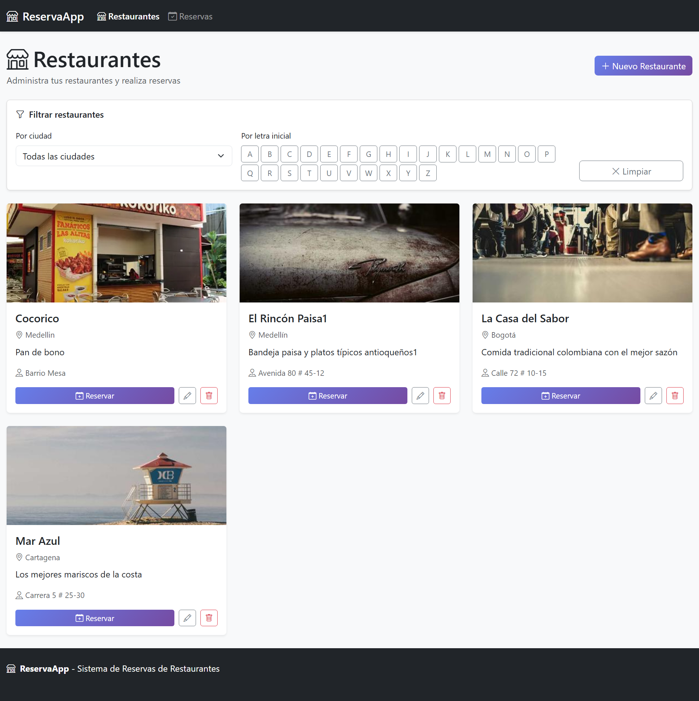
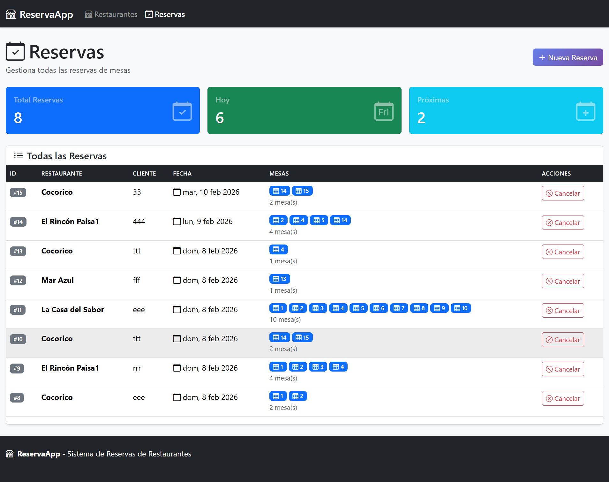

# 🍽️ ReservaApp - Sistema de Gestión de Reservas

> Sistema full-stack para gestión de reservas de restaurantes con validaciones de negocio y arquitectura escalable.

---

## 📸 Capturas del Proyecto

### Vista de Restaurantes


### Vista de Reservas


---

## 🎯 ¿Qué es ReservaApp?

ReservaApp es una aplicación web que permite a los restaurantes gestionar sus reservas de forma eficiente. Los usuarios pueden:

- Ver restaurantes disponibles con filtros por ciudad y letra inicial
- Reservar múltiples mesas simultáneamente
- Visualizar disponibilidad en tiempo real
- Gestionar reservas con validaciones de negocio automáticas

**Reglas de negocio:**
- Cada restaurante tiene 15 mesas (numeradas 1-15)
- Máximo 15 mesas reservadas por día por restaurante
- Máximo 20 mesas reservadas por día en total (todos los restaurantes)
- No se pueden duplicar reservas de la misma mesa en el mismo día

---

## 🏗️ Arquitectura del Proyecto

### ¿Por qué Feature-Based + App Factory?

Elegimos esta arquitectura porque **mapea perfectamente al dominio del negocio**:

**El proyecto tiene 2 dominios claros:**
1. Restaurantes (CRUD + filtros)
2. Reservas (validaciones complejas + disponibilidad)

**Feature-Based nos da:**
- ✅ **Cohesión**: Todo el código de una feature está junto
- ✅ **Escalabilidad**: Agregar features = agregar carpetas
- ✅ **Mantenibilidad**: Modificar reservas no toca restaurantes
- ✅ **Trabajo en equipo**: Devs trabajan en features separadas sin conflictos

```
src/front/features/
├── restaurantes/    # Todo de restaurantes aquí
│   ├── components/
│   ├── services/
│   └── pages/
└── reservas/        # Todo de reservas aquí
    ├── components/
    ├── services/
    └── pages/
```

**App Factory (Backend) nos da:**
- ✅ **Modularidad**: Blueprints independientes por feature
- ✅ **Testeable**: Cada Blueprint se puede testear aisladamente
- ✅ **Configuración flexible**: Dev usa SQLite, producción PostgreSQL

---

## 🛠️ Stack Tecnológico

### Backend
- **Flask 1.1.2** - Framework web Python
- **SQLAlchemy 1.3.23** - ORM para base de datos
- **Flask-Migrate** - Migraciones de BD
- **PostgreSQL** (producción) / **SQLite** (desarrollo)

### Frontend
- **React 18.2.0** - Librería UI
- **React Router DOM 6.18.0** - Enrutamiento
- **Vite 4.4.8** - Build tool ultrarrápido
- **Context API + useReducer** - Estado global sin Redux
- **Bootstrap 5** - Framework CSS

---

## 🚀 Inicio Rápido

### Prerrequisitos
- Python 3.8+
- Node.js 20+
- PostgreSQL (opcional, usa SQLite por defecto)

### 1. Clonar el repositorio
```bash
git clone https://github.com/eybagit/reservaciones-restaurante.git
cd reservaciones-restaurante
```

### 2. Backend (Terminal 1)
```bash
# Instalar dependencias
pip install -r requirements.txt

# Configurar variables de entorno (opcional)
cp .env.example .env

# Crear base de datos
flask db upgrade

# Insertar datos de prueba
flask insert-test-data

# Iniciar servidor backend (puerto 3001)
python src/app.py
```

### 3. Frontend (Terminal 2)
```bash
# Instalar dependencias
npm install

# Iniciar servidor de desarrollo (puerto 3000)
npm run dev
```
 
---

## 📁 Estructura del Proyecto

```
reservas/
├── src/
│   ├── api/                    # Backend Flask
│   │   ├── models.py          # Modelos SQLAlchemy
│   │   ├── routes/            # Blueprints por feature
│   │   │   ├── restaurante_routes.py
│   │   │   └── reserva_routes.py
│   │   ├── admin.py           # Panel administrativo
│   │   └── commands.py        # Comandos CLI
│   ├── front/                 # Frontend React
│   │   ├── features/          # Arquitectura feature-based
│   │   │   ├── restaurantes/
│   │   │   └── reservas/
│   │   ├── components/        # Componentes compartidos
│   │   ├── hooks/             # Custom hooks
│   │   └── store.js           # Estado global
│   └── app.py                 # Entry point Flask
├── migrations/                # Migraciones Alembic
├── mapaDeDatos/              # Documentación del proyecto
└── public/                   # Assets estáticos
```

---

## 🔌 API Endpoints

### Restaurantes
```
GET    /api/restaurantes              # Listar (con filtros)
GET    /api/restaurantes/:id          # Obtener por ID
POST   /api/restaurantes              # Crear
PUT    /api/restaurantes/:id          # Actualizar
DELETE /api/restaurantes/:id          # Eliminar
GET    /api/restaurantes/ciudades     # Listar ciudades
```

### Reservas
```
GET    /api/reservas                           # Listar todas
GET    /api/reservas/:id                       # Obtener por ID
POST   /api/reservas                           # Crear
DELETE /api/reservas/:id                       # Cancelar
GET    /api/reservas/disponibilidad/:id/:fecha # Verificar disponibilidad
GET    /api/reservas/restaurante/:id           # Filtrar por restaurante
```

---

## 💡 Características Destacadas

### 1. Filtros Avanzados de Restaurantes
- Filtro por letra inicial (A-Z)
- Filtro por ciudad
- Filtros combinados (letra + ciudad)
- Búsqueda en tiempo real

### 2. Sistema de Reservas Inteligente
- Selección visual de múltiples mesas
- Validación de disponibilidad en tiempo real
- Prevención de reservas duplicadas
- Límites automáticos por restaurante y globales

### 3. Validaciones de Negocio
- Backend valida todas las reglas de negocio
- Frontend muestra disponibilidad antes de reservar
- Mensajes de error claros y específicos

### 4. Estado Global Eficiente
- Context API + useReducer (sin Redux)
- Estado predecible y fácil de debuggear
- Separación clara entre estado local y global

---

## 🧪 Comandos Útiles

### Backend
```bash
# Crear N restaurantes de prueba
flask insert-test-restaurants 5

# Insertar datos predefinidos
flask insert-test-data

# Crear nueva migración
flask db migrate -m "descripción"

# Aplicar migraciones
flask db upgrade

# Revertir última migración
flask db downgrade
```

### Frontend
```bash
# Desarrollo
npm run dev

# Build de producción
npm run build

# Preview del build
npm run preview

# Linting
npm run lint
```

---

## 🎓 Conceptos Clave Aprendidos

### Backend
- App Factory Pattern con Flask
- Blueprints para modularidad
- SQLAlchemy ORM y relaciones
- Migraciones con Alembic
- Validaciones de negocio complejas

### Frontend
- Feature-Based Architecture
- Context API + useReducer para estado global
- Custom hooks reutilizables
- Separación de responsabilidades (componentes, servicios, páginas)
- Manejo de formularios con FormData

### Integración
- REST API con fetch
- Manejo de errores en ambos lados
- CORS para desarrollo
- Async/await para operaciones asíncronas

---

## 👨‍💻 Autor

**Elkin Botero (eybagit)** - [GitHub](https://github.com/eybagit)

---

## 📝 Licencia

Este proyecto es de código abierto bajo licencia ISC.

---

## 🙏 Agradecimientos

- Template base de [4Geeks Academy](https://www.4geeksacademy.com/)
- Comunidad de React y Flask

---

**⭐ Si este proyecto te fue útil, considera darle una estrella en GitHub**
